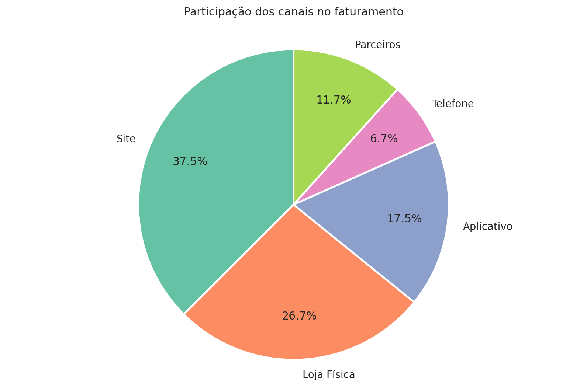
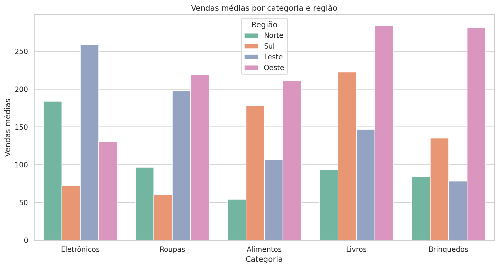
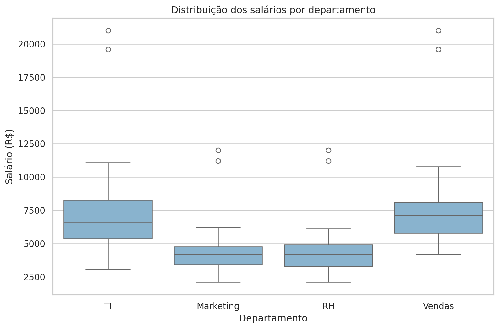
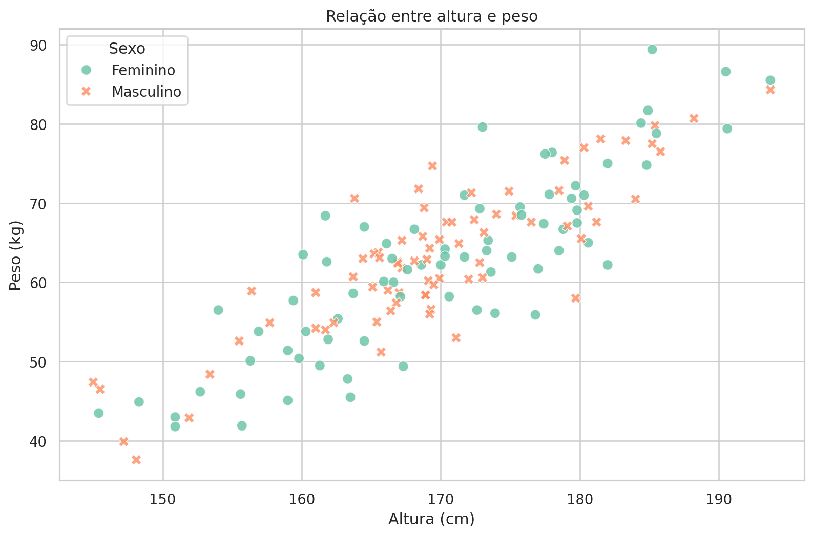
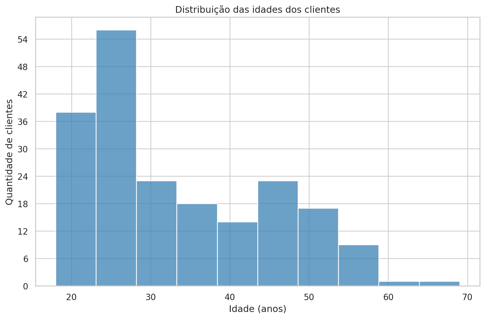
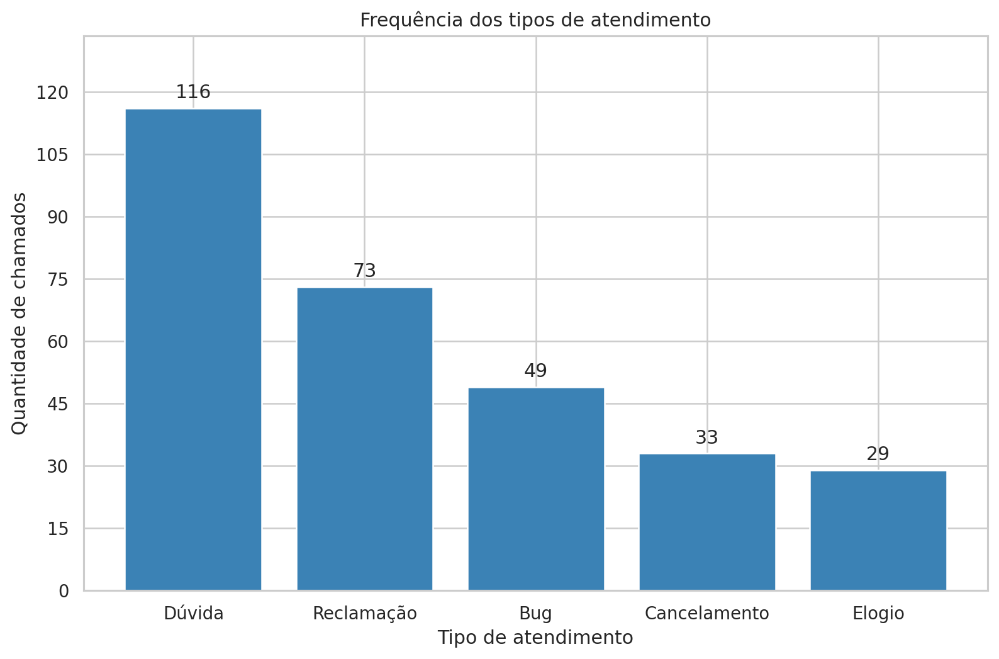
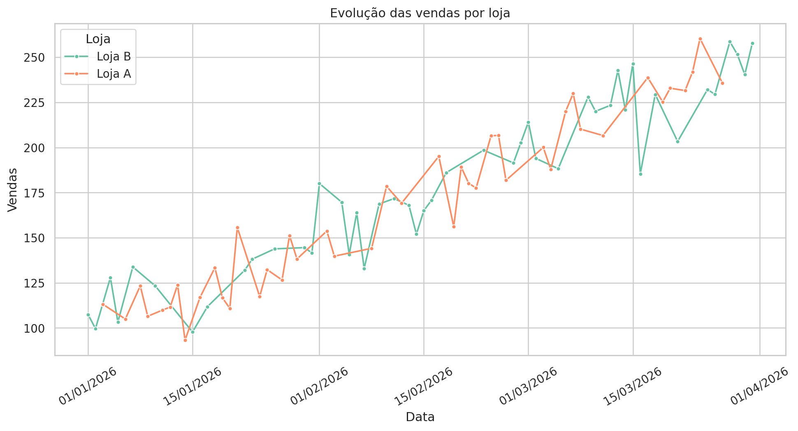
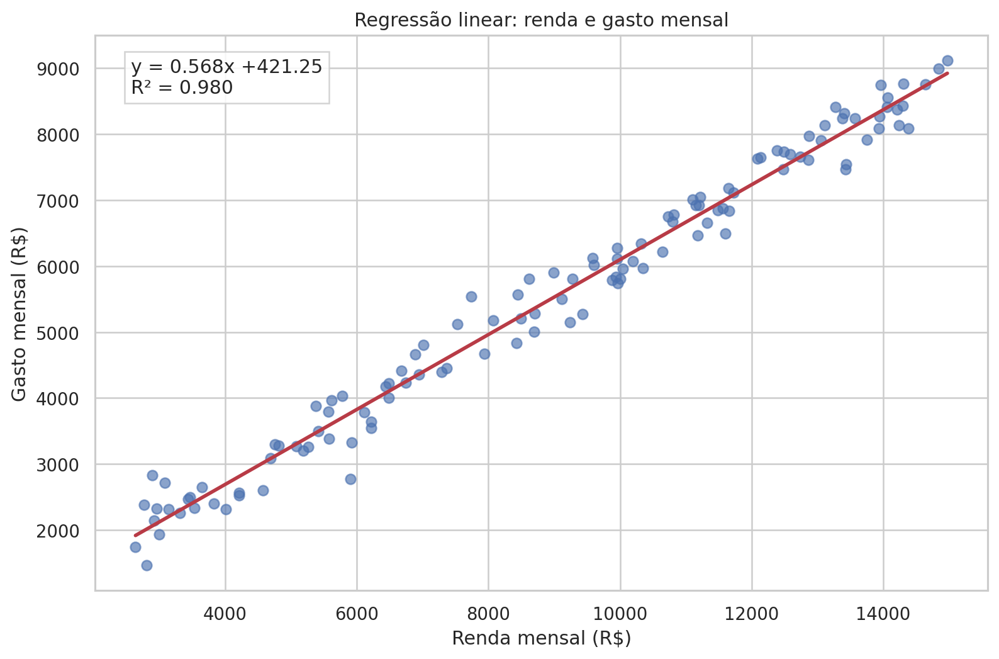
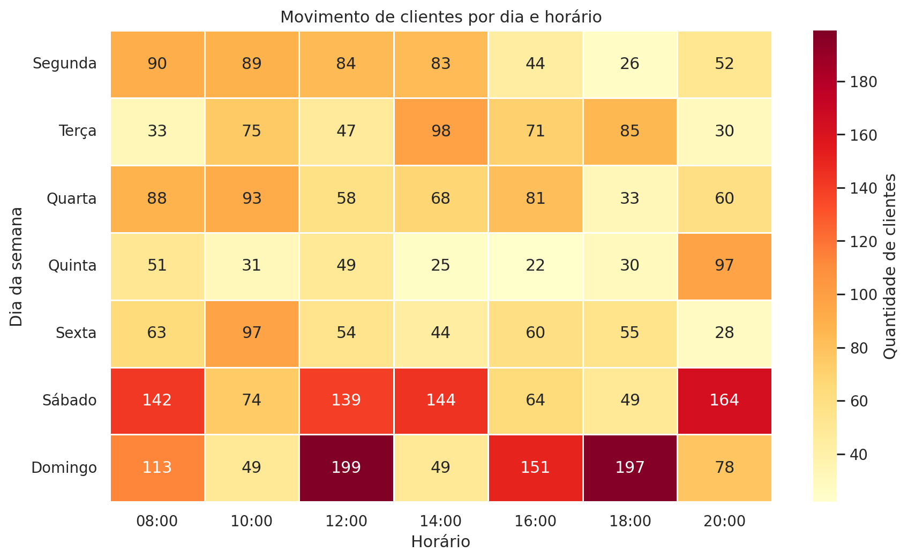

# Gráficos com Python

Atividade de visualização dos nove arquivos CSV fornecidos. Cada gráfico tem seu próprio script independente. Os CSV originais estão na pasta `dados/` e as imagens geradas, em `graficos/`.

## Arquivos e tipos de gráfico

Os tipos foram escolhidos conforme os nomes dos arquivos anexados.

| Dados | Script | Gráfico |
| --- | --- | --- |
| `dados_pizza.csv` | `grafico_pizza.py` | Pizza |
| `dados_barras.csv` | `grafico_barras.py` | Barras agrupadas por região |
| `dados_boxplot.csv` | `grafico_boxplot.py` | Boxplot por departamento |
| `dados_dispersao.csv` | `grafico_dispersao.py` | Dispersão por sexo |
| `dados_distribuicao.csv` | `grafico_distribuicao.py` | Histograma de idades |
| `dados_frequencia.csv` | `grafico_frequencia.py` | Barras de frequência absoluta |
| `dados_linhas.csv` | `grafico_linhas.py` | Linhas por loja |
| `dados_regressao.csv` | `grafico_regressao.py` | Regressão linear |
| `dados_heatmap.csv` | `grafico_heatmap.py` | Mapa de calor |

## Como executar

Requer Python 3.10 ou superior. Abra um terminal na pasta do projeto e instale as dependências:

```bash
python -m pip install -r requirements.txt
```

Execute o script desejado:

```bash
python grafico_pizza.py
python grafico_barras.py
python grafico_boxplot.py
python grafico_dispersao.py
python grafico_distribuicao.py
python grafico_frequencia.py
python grafico_linhas.py
python grafico_regressao.py
python grafico_heatmap.py
```

Cada comando salva um PNG em `graficos/`. Para também abrir a janela do gráfico, use, por exemplo, `python grafico_pizza.py --mostrar`. Os caminhos dos CSV são resolvidos a partir do próprio script, permitindo executá-lo de outra pasta.

## Critérios dos gráficos

- Pizza: participação percentual do faturamento por canal de venda.
- Barras: comparação das vendas médias por categoria, separadas por região. Os valores do CSV são usados diretamente.
- Boxplot: mediana, quartis, dispersão e valores extremos dos salários por departamento. Os pontos extremos não são removidos.
- Dispersão: altura e peso, diferenciados por sexo.
- Distribuição: histograma da idade com classes de cinco anos; o identificador do cliente não entra no gráfico.
- Frequência: contagem de chamados por tipo de atendimento, em ordem decrescente.
- Linhas: vendas em ordem cronológica, com uma linha por loja. Cada linha liga somente as observações disponíveis daquela loja, sem preencher datas ausentes com zero.
- Regressão: pontos observados, reta de mínimos quadrados, equação e R². A relação observada não demonstra causalidade.
- Heatmap: movimento de clientes por horário e dia da semana, de segunda a domingo.


## Gráficos gerados

### Pizza



### Barras



### Boxplot



### Dispersao



### Distribuicao



### Frequencia



### Linhas



### Regressao



### Heatmap


